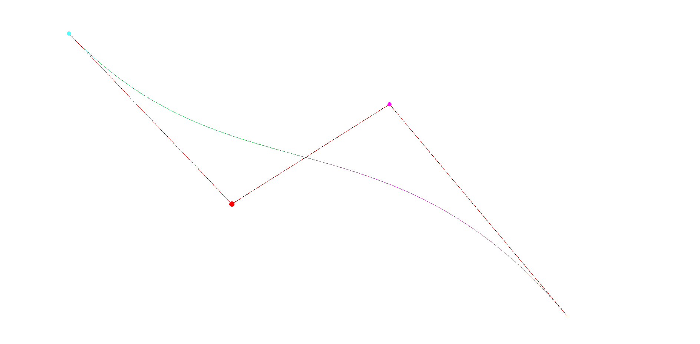

# WebGL Shaders Project

Try the project live here:
🎮 [**WebGL Shader Playground**](https://lmalvarez13.github.io/shaders-project/)

Made as a final assignment for Computer Graphics subject at the University.

  
  

## Table of Contents
- [Overview](#webgl-shaders-project)
- [What I Learned](#what-i-learned-throughout-this-course)
- [Getting Started & Controls](#getting-started--controls)

  
## What I learned throughout this course

- Theorical understanding of how:
  - Blending formulas are applied to 3D objects (parametrics surfaces/Bézier patches/NURBS surfaces) 
  - Catmull-Clark Subdivision: how it works & application
  - Meshes 3D represantation: how .obj loads in GPU memory, meshes tophologies, Halfedge structure
  - Texture mappings, GPU Pipeline (Vertex->Razterization->Fragment), Mipmaps, Bilinear/Trilinear & Anisotropic filtering
  - Lighting effects calculation: diffuse lighting, specular reflexion, Phong/Blinn-Phong models, Phong/Gouraud shadows

  

 
- Practical application of:
  - GPU Pipeline with GLSL: from how .obj files are loaded to the application of vertex/fragment shaders
  - Camera's 3D space represantation: Orthographic vs Perspective projection
  - Phong's lighting effect: application & variants
  - Implemented different Fragment shaders from scratch on GLSL (Toon/Cosine/Stripe/Dot/Pencil shaders)

  
  

## Getting Started & Controls

Here's a quick guide on how to open and test it yourself:
  1. Click **Load Model** and select any .obj file (there are a few examples inside [./docs/models](https://github.com/lmalvarez13/shaders-project/tree/main/docs/models))
  2. Then use **Load Texture** button (both .png or .jpg will do) if you want to give it more style (each .obj has its respective texture inside the same folder)
  3. **Lighting Controls**: you can left click the top-right square and change the lighting's direction
  4. **Select a Shader**: on the bottom right of the screen there are multiple shaders that you can test !
  5. Other Controls:
     - **Effect** will control the shader's intensity (0.0 no intensity | 10 full intensity)
     - **Velocity** can be used for both Cosine Shader and Stripe Shader only
     - **Calesita** makes the model rotate continuously at a certain speed

---
